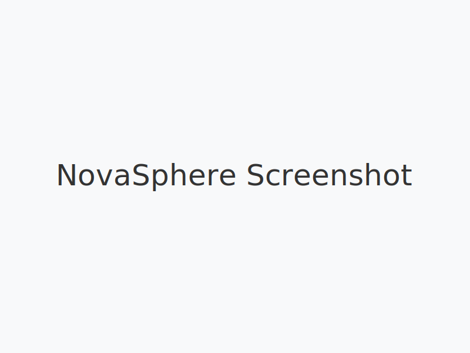

# NovaSphere - The Future of Personal Computing



This repository contains the landing page for NovaSphere, an imaginary product that features holographic interfaces and advanced computing technologies.

## About

NovaSphere is a concept for a next-generation personal computing device that uses holographic displays to create a truly immersive and interactive experience. This repository contains the source code for the landing page that showcases the product.

## Features

*   **Holographic Interface:** A stunning visual representation of the NovaSphere product.
*   **Interactive Elements:** Engaging animations and transitions to capture user interest.
*   **Responsive Design:** The landing page is fully responsive and looks great on all devices.

## Getting Started

To get a local copy up and running, follow these simple steps.

### Prerequisites

*   A modern web browser.

### Installation

1.  Clone the repo:
    ```sh
    git clone https://github.com/your_username/novasphere.git
    ```
2.  Open `index.html` in your browser.

## Contributing

Contributions are what make the open-source community such an amazing place to learn, inspire, and create. Any contributions you make are **greatly appreciated**.

If you have a suggestion that would make this better, please fork the repo and create a pull request. You can also simply open an issue with the tag "enhancement".

Don't forget to give the project a star! Thanks again!
